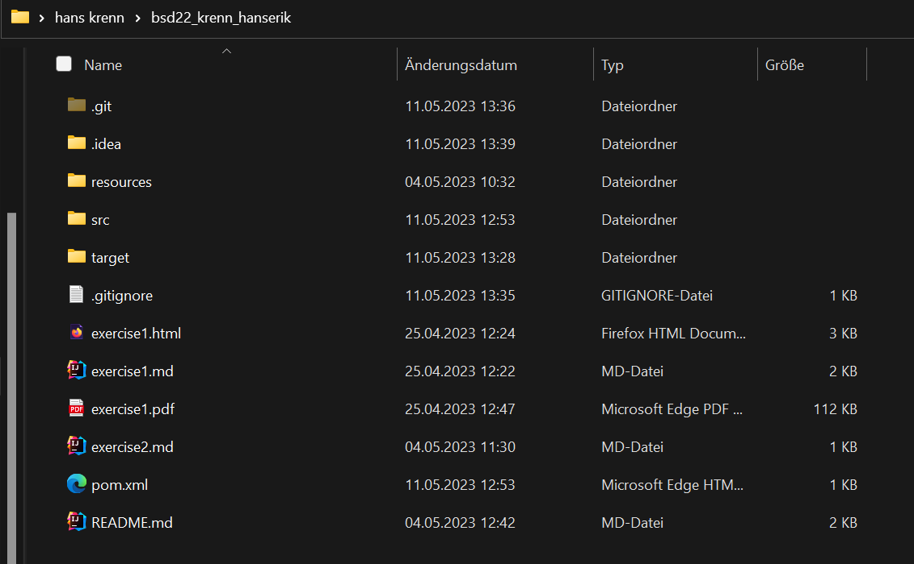

# Exercise 3

## What i did
 
- Install maven
- Install JDK
- ???
- Created the Maven Project in this one
- Added the target folder 
- Written some smart methods for my Calculator Programm

### Images

Folder structure

Build

