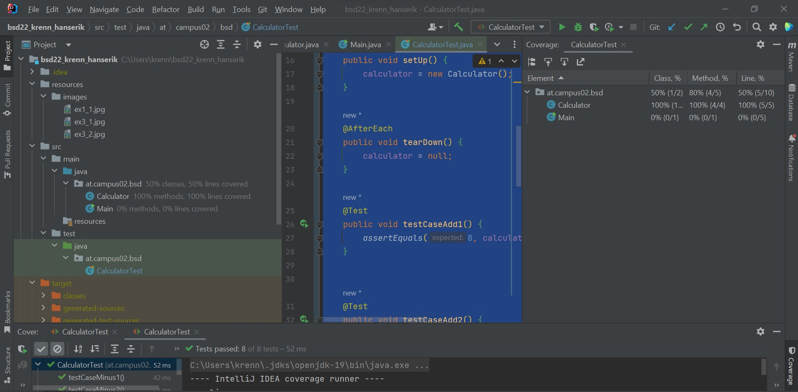
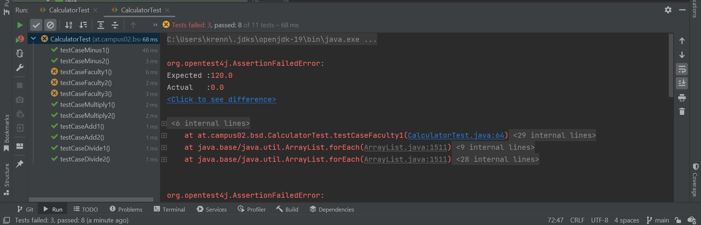

# Exercise 4

## What i did

 - Created test cases
 - Extended the pom.xml with its dependencies (had to reload the Maven project)
 - Didn't forget to add exercise4.md to the README.md
 - Added the screenshot showing the test coverage
 - Created getfaculty method and added a screenshot of failed testcases
 - Changed the return value so the testcases dont fail

### Test coverage

### Failed Test cases

